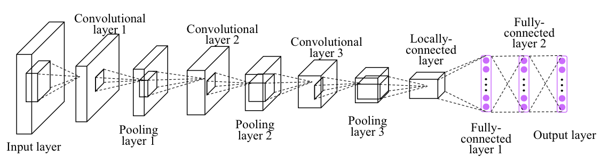

# Scene Classification of Satellite Imagery using a Convolutional Neural Network (CNN)

A tutorial with a Jupyter Notebook to show how a simple Convolutional Neural Network (CNN) can be built for satellite image classification.



## Clone the repo

To run this repo, first clone it to a local location of your choice and `cd` into it:

```sh
git clone https://github.com/vikasnataraja/satellite_cnn_tutorial.git

# alternatively, if you have ssh keys installed for git, you can use this instead
# git clone git@github.com:vikasnataraja/satellite_cnn_tutorial.git

cd satellite_cnn_tutorial/
```

## Install the necessary packages

It is recommended to create a new conda environment with Python 3.10 for this tutorial:

```sh
conda env create -f environment.yml
```

or you can execute the following commands one by one in a terminal.

```sh
conda create -n cnn python=3.10 -y
conda activate cnn
conda install -c conda-forge numpy matplotlib jupyterlab pillow -y
conda install -c conda-forge xarray dask netCDF4 bottleneck - y
conda install tensorflow==2.12.0 -y
conda install -c conda-forge keras==2.12.0 -y
conda install -c anaconda pillow -y

```

**Note**: Anaconda installation of tensorflow tends to be slow (30 - 60 minutes). Please feel free to run this in the background beforehand.

## Using the repo

The entire workflow is hosted on the Jupyter notebook `convolutional_neural_network.ipynb` so you should be able to run this notebook after following the previous installation steps!
